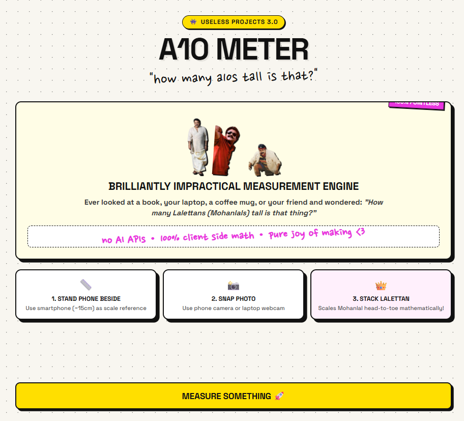
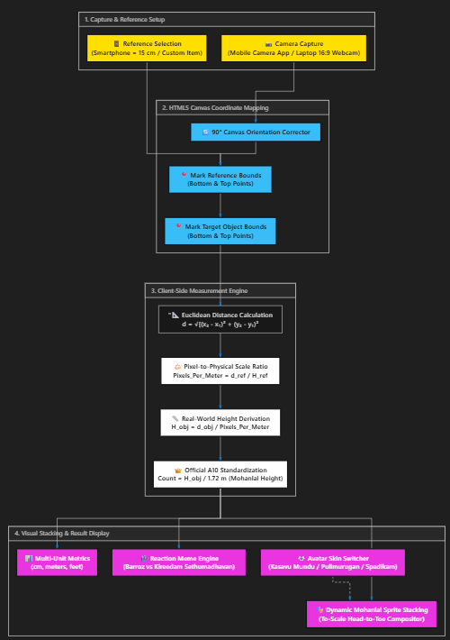
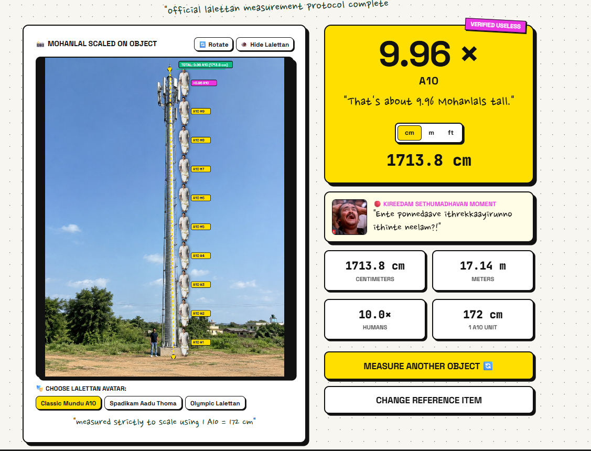

# [A10 METER] 🎯

## Basic Details
### Team Name: [CodeAlpha]

### Team Members
- Team Lead: [Jesbin Shaju] - [Mar Athanasius College of Engineering]
- Member 2: [Anandhu Babu] - [Mar Athanasius College of Engineering]

### Project Description
An absurd camera ruler that measures everyday objects using your smartphone as a scale reference, then converts their height into pure Mohanlals (1 A10 = 1.72 m). Just snap a picture, mark the points, and watch cutouts of Lalettan stack up on top of the object to show you exactly how many A10s tall it is.

### The Problem (that doesn't exist)
Meters, feet, and centimeters are emotionally empty units that have zero cinematic heroism. When someone looks at a cupboard, a coconut tree, or their friend, modern science gives them no way of knowing how many Lalettans tall it is—leaving society in utter existential crisis without an official Mohanlal measurement standard.

### The Solution (that nobody asked for)
We took matters into our own hands and dethroned the metric system. A10 Meter lets you point your camera at literally anything, uses your phone to calculate the scale, and stacks Lalettans on your screen so you can proudly declare to the world: "Yes, this wardrobe is officially 1.25 Mohanlals tall."

## Technical Details
### Technologies/Components Used
For Software:
- **Languages used:** TypeScript, JavaScript, HTML5, CSS3
- **Frameworks used:** React 19
- **Libraries used:** HTML5 Canvas API (for 2D measurement rendering & image stacking), MediaDevices API (`getUserMedia` for webcam & native camera capture), FileReader API
- **Tools used:** Vite, VS Code, Git, GitHub

### Implementation
For Software:
# Installation
git clone https://github.com/your-username/a10-meter.git
cd a10-meter
npm install

# Run
npm run dev 

### Project Documentation
For Software:

# Screenshots (Add at least 3)

*The A10 Meter landing screen and measurement workflow entry point.*

*The camera measurement interface used to select reference points.*

*The result view showing the measured height in Mohanlals.*

# Diagrams

*The application architecture and measurement flow.*

*The completed application displaying the final measurement.*

### Project Demo
# Video
https://youtu.be/jlhBhz-OxWQ
Demonstrates the height of an unknown thing which we find using the height of a known object and th standard of measurement is Lalettan

# Additional Demos
https://a10meter-nine.vercel.app/

## Team Contributions
[Anandhu Babu]: [Idea,Development,Design]
[Jesbin Shaju]: [Development,DesignPolishing]

---
Made with ❤️ at TinkerHub Useless Projects 

